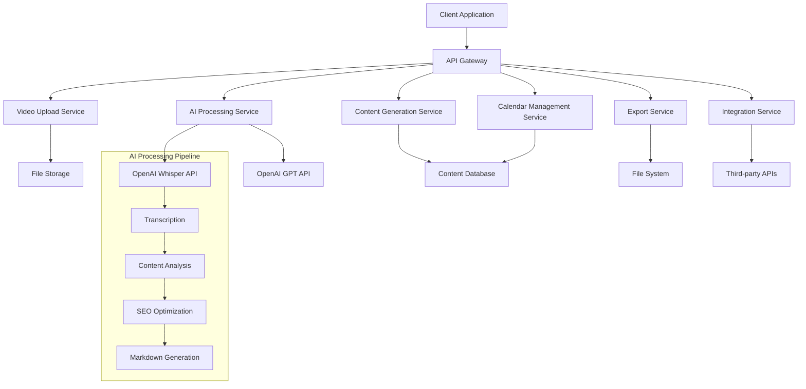

# Design Document

## Overview

The AI Blog Generator feature transforms Linkify AI into a comprehensive content creation platform that automatically generates high-quality, SEO-optimized blog posts from uploaded video content. The system leverages advanced AI processing to analyze video content, extract key themes and insights, and generate engaging blog posts in Markdown format with intelligent content management and calendar-based scheduling capabilities.

This design focuses heavily on the frontend UI/UX experience, ensuring users can seamlessly interact with Linkify AI's powerful content generation capabilities through an intuitive, modern interface that reflects the Linkify brand identity.

## Architecture

### High-Level System Architecture



### Technology Stack

**Frontend (Primary Focus):**
- Next.js 14 with App Router for server-side rendering and optimal performance
- React 18 with TypeScript for type-safe component development
- Tailwind CSS for responsive UI design matching Linkify AI brand guidelines
- Framer Motion for smooth animations and transitions
- React Hook Form for form management and validation
- Zustand for client-side state management
- Radix UI for accessible component primitives
- React Query (TanStack Query) for server state management

**Backend:**
- Next.js API Routes for serverless functions
- Prisma ORM with PostgreSQL for data persistence
- OpenAI APIs (Whisper for transcription, GPT-4 for content generation)
- AWS S3 or similar for file storage
- Redis for caching and session management

**Infrastructure:**
- Vercel for deployment and hosting
- PostgreSQL database (Supabase or similar)
- CDN for static asset delivery
- Queue system for background processing (Vercel Cron or similar)

## Components and Interfaces

### Frontend UI/UX Components (Primary Focus)

#### Brand Identity Integration
All components will reflect Linkify AI's brand identity with:
- Consistent color scheme and typography
- Linkify AI logo and branding elements
- Modern, professional design language
- Accessible and responsive design patterns

### Core UI Components

#### 1. Video Upload Component
**UI/UX Features:**
- Drag-and-drop interface with visual feedback
- Progress indicators with Linkify AI branding
- File format validation with user-friendly error messages
- Preview thumbnails and file information display
- Responsive design for mobile and desktop

```typescript
interface VideoUploadProps {
  onUploadComplete: (fileId: string) => void;
  onUploadProgress: (progress: number) => void;
  maxFileSize: number;
  acceptedFormats: string[];
  className?: string;
  theme?: 'light' | 'dark'; // Linkify AI theme support
}

interface UploadedFile {
  id: string;
  filename: string;
  size: number;
  format: string;
  uploadedAt: Date;
  status: 'uploading' | 'processing' | 'completed' | 'error';
  thumbnail?: string;
}
```

#### 2. AI Processing Engine
```typescript
interface AIProcessingService {
  transcribeVideo(fileId: string): Promise<TranscriptionResult>;
  generateContent(transcription: string, keywords: string[]): Promise<BlogPost>;
  optimizeForSEO(content: string, targetKeywords: string[]): Promise<OptimizedContent>;
}

interface TranscriptionResult {
  text: string;
  confidence: number;
  segments: TranscriptionSegment[];
  language: string;
}

interface BlogPost {
  title: string;
  content: string;
  excerpt: string;
  keywords: string[];
  readingTime: number;
  seoScore: number;
}
```

#### 3. Calendar Management System
**UI/UX Features:**
- Interactive calendar with Linkify AI design system
- Drag-and-drop scheduling functionality
- Color-coded content status indicators
- Responsive calendar views (month/week/day)
- Smooth animations for date transitions
- Context menus for quick actions

```typescript
interface CalendarEvent {
  id: string;
  title: string;
  date: Date;
  type: 'draft' | 'scheduled' | 'published';
  blogPostId: string;
  status: 'pending' | 'processing' | 'completed';
  color?: string; // For visual categorization
}

interface CalendarProps {
  events: CalendarEvent[];
  onEventMove: (eventId: string, newDate: Date) => void;
  onEventClick: (event: CalendarEvent) => void;
  view: 'month' | 'week' | 'day';
  theme: 'linkify-light' | 'linkify-dark';
  className?: string;
}
```

#### 4. Content Editor Interface
**UI/UX Features:**
- Rich text editor with Markdown preview
- Real-time AI suggestions with visual indicators
- Linkify AI branded toolbar and controls
- Distraction-free writing mode
- Auto-save functionality with status indicators
- SEO score visualization and recommendations

```typescript
interface ContentEditorProps {
  content: string;
  onChange: (content: string) => void;
  suggestions: AISuggestion[];
  onApplySuggestion: (suggestionId: string) => void;
  readOnly?: boolean;
  theme: 'linkify-light' | 'linkify-dark';
  showPreview?: boolean;
  autoSave?: boolean;
}

interface AISuggestion {
  id: string;
  type: 'seo' | 'readability' | 'engagement';
  message: string;
  replacement?: string;
  confidence: number;
  position?: { line: number; column: number }; // For precise highlighting
}
```

#### 5. Linkify AI Dashboard Components
**UI/UX Features:**
- Modern dashboard layout with Linkify AI branding
- Usage analytics and subscription tier display
- Quick action buttons for common tasks
- Recent content overview with status indicators
- Responsive grid layout for different screen sizes

```typescript
interface DashboardProps {
  user: User;
  recentContent: BlogPost[];
  usageStats: UsageStats;
  onQuickAction: (action: string) => void;
}

interface UsageStats {
  currentUsage: number;
  monthlyLimit: number;
  subscriptionTier: 'basic' | 'pro' | 'business';
  renewalDate: Date;
}
```

#### 6. Navigation and Layout Components
**UI/UX Features:**
- Consistent navigation with Linkify AI logo
- Breadcrumb navigation for deep pages
- Mobile-responsive sidebar and header
- User profile dropdown with account management
- Theme toggle for light/dark modes

```typescript
interface NavigationProps {
  currentPath: string;
  user: User;
  onNavigate: (path: string) => void;
  theme: 'light' | 'dark';
}

interface LayoutProps {
  children: React.ReactNode;
  title: string;
  showSidebar?: boolean;
  className?: string;
}
```

### API Interfaces

#### Video Processing API
```typescript
// POST /api/videos/upload
interface UploadVideoRequest {
  file: File;
  metadata?: {
    title?: string;
    description?: string;
    tags?: string[];
  };
}

interface UploadVideoResponse {
  fileId: string;
  uploadUrl: string;
  status: string;
}

// POST /api/videos/process
interface ProcessVideoRequest {
  fileId: string;
  options: {
    targetKeywords?: string[];
    contentLength?: 'short' | 'medium' | 'long';
    tone?: 'professional' | 'casual' | 'technical';
  };
}
```

#### Content Management API
```typescript
// GET /api/content
interface GetContentRequest {
  page?: number;
  limit?: number;
  status?: 'draft' | 'published' | 'scheduled';
  dateRange?: {
    start: Date;
    end: Date;
  };
}

// POST /api/content/export
interface ExportContentRequest {
  contentId: string;
  format: 'markdown' | 'html' | 'json';
  includeMetadata: boolean;
}
```

## Data Models

### Database Schema

```sql
-- Users table
CREATE TABLE users (
  id UUID PRIMARY KEY DEFAULT gen_random_uuid(),
  email VARCHAR(255) UNIQUE NOT NULL,
  subscription_tier VARCHAR(50) NOT NULL DEFAULT 'basic',
  usage_count INTEGER DEFAULT 0,
  usage_limit INTEGER NOT NULL,
  created_at TIMESTAMP DEFAULT NOW(),
  updated_at TIMESTAMP DEFAULT NOW()
);

-- Videos table
CREATE TABLE videos (
  id UUID PRIMARY KEY DEFAULT gen_random_uuid(),
  user_id UUID REFERENCES users(id) ON DELETE CASCADE,
  filename VARCHAR(255) NOT NULL,
  file_path VARCHAR(500) NOT NULL,
  file_size BIGINT NOT NULL,
  format VARCHAR(50) NOT NULL,
  duration INTEGER, -- in seconds
  status VARCHAR(50) DEFAULT 'uploaded',
  created_at TIMESTAMP DEFAULT NOW(),
  updated_at TIMESTAMP DEFAULT NOW()
);

-- Blog posts table
CREATE TABLE blog_posts (
  id UUID PRIMARY KEY DEFAULT gen_random_uuid(),
  user_id UUID REFERENCES users(id) ON DELETE CASCADE,
  video_id UUID REFERENCES videos(id) ON DELETE SET NULL,
  title VARCHAR(500) NOT NULL,
  content TEXT NOT NULL,
  excerpt TEXT,
  keywords TEXT[], -- PostgreSQL array
  seo_score INTEGER DEFAULT 0,
  reading_time INTEGER DEFAULT 0,
  status VARCHAR(50) DEFAULT 'draft',
  scheduled_at TIMESTAMP,
  published_at TIMESTAMP,
  created_at TIMESTAMP DEFAULT NOW(),
  updated_at TIMESTAMP DEFAULT NOW()
);

-- AI suggestions table
CREATE TABLE ai_suggestions (
  id UUID PRIMARY KEY DEFAULT gen_random_uuid(),
  blog_post_id UUID REFERENCES blog_posts(id) ON DELETE CASCADE,
  type VARCHAR(50) NOT NULL,
  message TEXT NOT NULL,
  replacement TEXT,
  confidence DECIMAL(3,2),
  applied BOOLEAN DEFAULT FALSE,
  created_at TIMESTAMP DEFAULT NOW()
);

-- Integrations table
CREATE TABLE integrations (
  id UUID PRIMARY KEY DEFAULT gen_random_uuid(),
  user_id UUID REFERENCES users(id) ON DELETE CASCADE,
  platform VARCHAR(100) NOT NULL,
  credentials JSONB NOT NULL, -- encrypted
  settings JSONB DEFAULT '{}',
  active BOOLEAN DEFAULT TRUE,
  created_at TIMESTAMP DEFAULT NOW(),
  updated_at TIMESTAMP DEFAULT NOW()
);
```

### TypeScript Models

```typescript
interface User {
  id: string;
  email: string;
  subscriptionTier: 'basic' | 'pro' | 'business';
  usageCount: number;
  usageLimit: number;
  createdAt: Date;
  updatedAt: Date;
}

interface Video {
  id: string;
  userId: string;
  filename: string;
  filePath: string;
  fileSize: number;
  format: string;
  duration?: number;
  status: 'uploaded' | 'processing' | 'completed' | 'error';
  createdAt: Date;
  updatedAt: Date;
}

interface BlogPost {
  id: string;
  userId: string;
  videoId?: string;
  title: string;
  content: string;
  excerpt?: string;
  keywords: string[];
  seoScore: number;
  readingTime: number;
  status: 'draft' | 'scheduled' | 'published';
  scheduledAt?: Date;
  publishedAt?: Date;
  createdAt: Date;
  updatedAt: Date;
}
```

## Error Handling

### Error Types and Responses

```typescript
interface APIError {
  code: string;
  message: string;
  details?: any;
  timestamp: Date;
}

enum ErrorCodes {
  // Upload errors
  FILE_TOO_LARGE = 'FILE_TOO_LARGE',
  UNSUPPORTED_FORMAT = 'UNSUPPORTED_FORMAT',
  UPLOAD_FAILED = 'UPLOAD_FAILED',
  
  // Processing errors
  TRANSCRIPTION_FAILED = 'TRANSCRIPTION_FAILED',
  CONTENT_GENERATION_FAILED = 'CONTENT_GENERATION_FAILED',
  AI_SERVICE_UNAVAILABLE = 'AI_SERVICE_UNAVAILABLE',
  
  // Subscription errors
  USAGE_LIMIT_EXCEEDED = 'USAGE_LIMIT_EXCEEDED',
  SUBSCRIPTION_EXPIRED = 'SUBSCRIPTION_EXPIRED',
  
  // Integration errors
  INTEGRATION_AUTH_FAILED = 'INTEGRATION_AUTH_FAILED',
  EXTERNAL_API_ERROR = 'EXTERNAL_API_ERROR'
}
```

### Error Handling Strategy

1. **Client-Side Error Handling:**
   - Toast notifications for user-facing errors
   - Retry mechanisms for transient failures
   - Graceful degradation for non-critical features
   - Loading states and error boundaries

2. **Server-Side Error Handling:**
   - Structured error logging with correlation IDs
   - Circuit breaker pattern for external API calls
   - Automatic retry with exponential backoff
   - Dead letter queues for failed processing jobs

3. **AI Service Error Handling:**
   - Fallback to alternative AI models if primary fails
   - Partial processing recovery (save transcription even if content generation fails)
   - Rate limiting and quota management
   - Timeout handling for long-running operations

## Testing Strategy

### Unit Testing
- **Frontend Components:** React Testing Library for component behavior
- **API Routes:** Jest for endpoint logic and validation
- **Utility Functions:** Comprehensive test coverage for data processing
- **AI Integration:** Mock external APIs for consistent testing

### Integration Testing
- **API Integration:** Test complete request/response cycles
- **Database Operations:** Test data persistence and retrieval
- **File Upload Flow:** End-to-end upload and processing pipeline
- **Authentication:** User session and permission testing

### End-to-End Testing
- **User Workflows:** Playwright for complete user journeys
- **Cross-Browser Testing:** Ensure compatibility across browsers
- **Mobile Responsiveness:** Test on various device sizes
- **Performance Testing:** Load testing for concurrent users

### AI Model Testing
- **Transcription Accuracy:** Test with various audio qualities and languages
- **Content Quality:** Evaluate generated content against quality metrics
- **SEO Optimization:** Validate keyword integration and optimization
- **Edge Cases:** Handle unusual video content and formats

## Performance Considerations

### Frontend Optimization
- **Code Splitting:** Dynamic imports for feature-based chunks
- **Image Optimization:** Next.js Image component with lazy loading
- **Caching Strategy:** SWR for data fetching with stale-while-revalidate
- **Bundle Analysis:** Regular monitoring of bundle size

### Backend Optimization
- **Database Indexing:** Optimize queries with proper indexes
- **Caching Layer:** Redis for frequently accessed data
- **API Rate Limiting:** Prevent abuse and ensure fair usage
- **Background Processing:** Queue system for heavy AI operations

### AI Processing Optimization
- **Batch Processing:** Group multiple requests for efficiency
- **Model Selection:** Choose appropriate model size based on requirements
- **Streaming Responses:** Real-time updates for long-running operations
- **Result Caching:** Cache AI responses for similar inputs

## Security Considerations

### Data Protection
- **File Encryption:** Encrypt uploaded videos at rest and in transit
- **API Security:** JWT tokens with proper expiration and refresh
- **Input Validation:** Sanitize all user inputs and file uploads
- **CORS Configuration:** Restrict cross-origin requests appropriately

### Privacy Compliance
- **Data Retention:** Automatic deletion of processed videos after specified period
- **User Consent:** Clear consent mechanisms for AI processing
- **Data Export:** Allow users to export their data
- **Right to Deletion:** Implement complete data removal on request

### AI Security
- **Prompt Injection Protection:** Sanitize inputs to AI models
- **Content Filtering:** Detect and handle inappropriate content
- **Rate Limiting:** Prevent abuse of AI services
- **Audit Logging:** Track all AI processing activities

## Scalability Architecture

### Horizontal Scaling
- **Microservices:** Separate services for upload, processing, and content management
- **Load Balancing:** Distribute traffic across multiple instances
- **Database Sharding:** Partition data based on user or content
- **CDN Integration:** Global content delivery for static assets

### Vertical Scaling
- **Resource Optimization:** Efficient memory and CPU usage
- **Database Optimization:** Query optimization and connection pooling
- **Caching Strategy:** Multi-level caching (browser, CDN, application, database)
- **Background Jobs:** Asynchronous processing for heavy operations